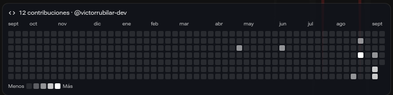
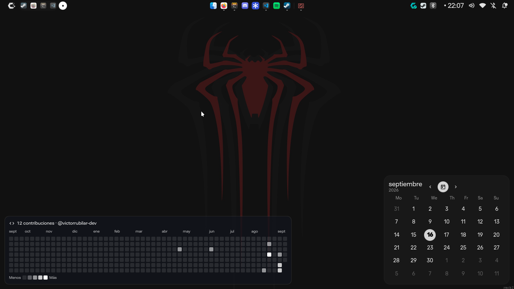

<h1 align="center">
     <br>
    GitHub Contributions Widget for iNiR
</h1>

<p align="center">
  <a href="https://github.com/snowarch/iNiR">
    
  </a>
</p>

<p align="center">
  A desktop widget for <b>iNiR</b> (powered by Quickshell) that displays your GitHub contribution graph right on your desktop, similar to your GitHub profile card.
</p>

## Features

- **No API Token Required:** Uses the free public API (`github-contributions-api.jogruber.de`).
- **Customizable Themes:** Switch between the classic GitHub green theme and dynamic desktop theme colors.
- **Interactive Tooltips:** Hover over any square to see the exact number of contributions and date.
- **Flexible UI:** Toggle month labels, legend, and total contribution counters on the fly via the edit menu.
- **Auto-refresh:** Configurable refresh intervals.

## Preview

**Widget**



--- 

**Desktop**




## Installation

1. Clone this repository:

   ```bash
   git clone https://github.com/victorrubilar-dev/inir-github-contributions.git
   ```

2. Move it to your iNiR widgets folder: (The name **github-contributions** is very important)

   ```bash
   cp inir-github-contributions ~/.config/inir/widgets/github-contributions
   ```

## Configuration

Right-click or enter Edit Mode on the widget to adjust settings:

* Username: Set your GitHub username.

* Toggles: Show or hide Month Labels, Legend, and Total Contributions.

* Color Scheme: Choose between Classic (GitHub Greens) or Theme (blended dark/light desktop tinting).

## License

Distributed under the [MIT License](LICENSE).
